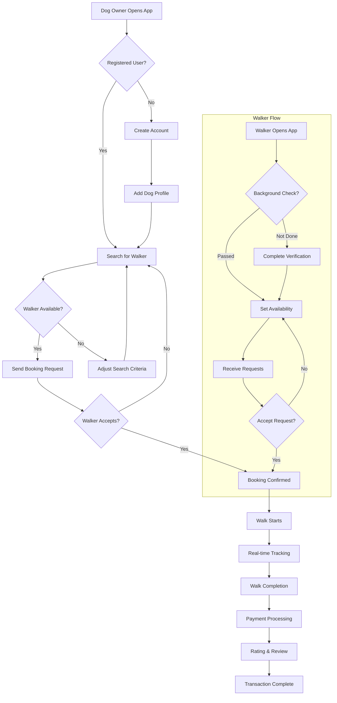
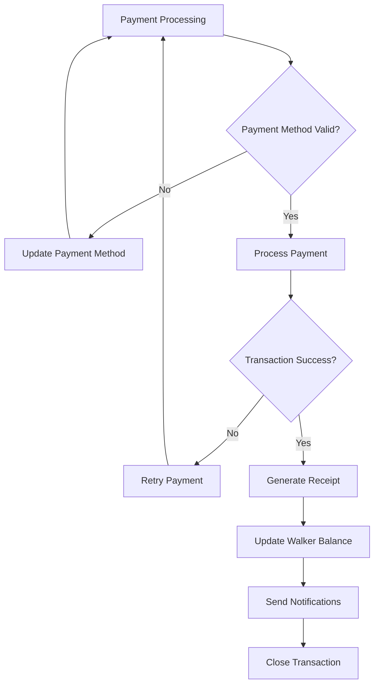
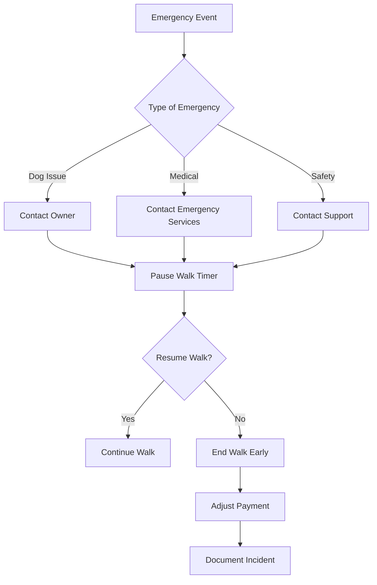
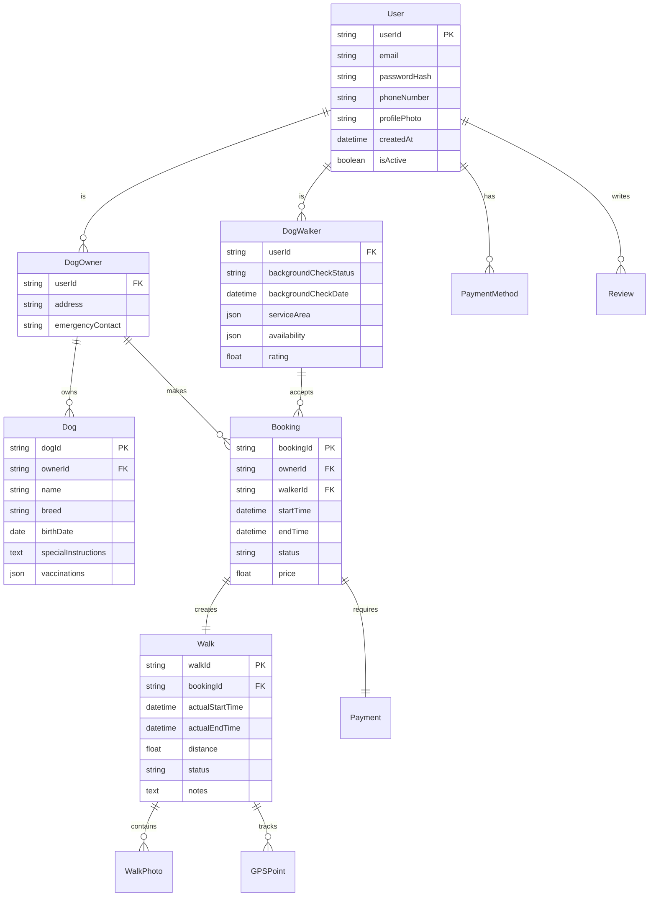
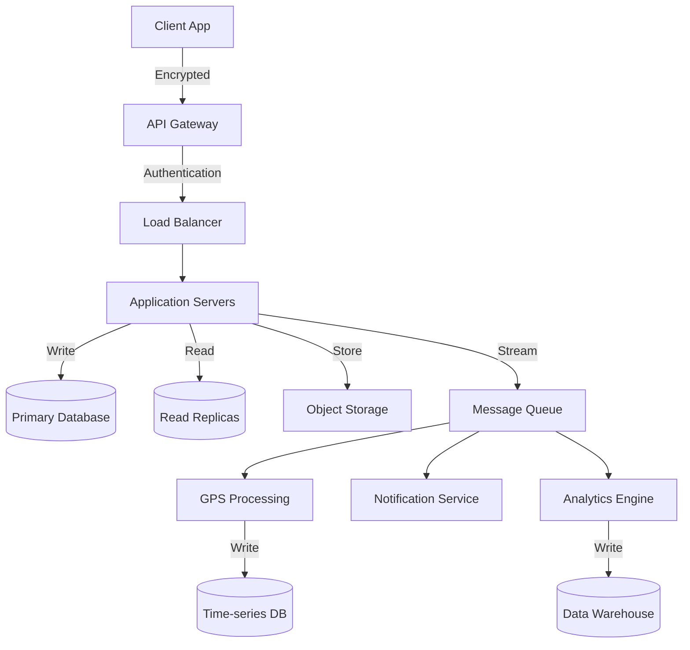

# Product Requirements Document (PRD)

# 1. INTRODUCTION

## 1.1 Purpose

This Software Requirements Specification (SRS) document provides a comprehensive description of the dog walking mobile application. It details the functional and non-functional requirements for both iOS and Android platforms. The document serves as the primary reference for technical teams, stakeholders, and project managers involved in the development process.

## 1.2 Scope

The dog walking application is a location-based service platform connecting dog owners with professional dog walkers. The system encompasses:

- User management for both dog owners and dog walkers
- Real-time booking and scheduling system
- GPS-enabled walk tracking
- Secure payment processing
- Two-way rating and review system

Key features and functionalities include:

| Feature Category | Core Capabilities |
|-----------------|-------------------|
| Profile Management | - Dog owner profiles with pet information - Walker profiles with verification status - Service preferences and availability settings |
| Booking System | - Real-time walker discovery - Location-based matching - Schedule management - Walk confirmation workflow |
| Walk Execution | - Live GPS tracking - Real-time messaging - Walk status updates - Photo sharing capabilities |
| Payment Processing | - Secure payment handling - Automated post-walk billing - Transaction history - Receipt generation |

The application will not include:
- Pet boarding services
- Veterinary services
- Pet supply sales
- Group walking coordination
- Training services

# 2. PRODUCT DESCRIPTION

## 2.1 Product Perspective

The dog walking application operates as a standalone mobile platform while integrating with several external systems:

| System Integration | Purpose |
|-------------------|----------|
| Payment Gateway | Secure payment processing and financial transactions |
| Maps/Location Services | Real-time GPS tracking and location-based matching |
| Push Notification System | Real-time alerts and communication |
| Cloud Storage | User data, photos, and transaction history |
| Background Check API | Walker verification services |

## 2.2 Product Functions

The primary functions of the system include:

- **User Registration and Profile Management**
  - Dog owner profile creation with pet details
  - Walker profile creation with verification process
  - Service area and availability management

- **Booking and Scheduling**
  - Real-time walker discovery and matching
  - Schedule management and calendar integration
  - Booking confirmation workflow
  - Automated notifications

- **Walk Management**
  - Live GPS tracking and route recording
  - Photo and update sharing
  - Emergency contact system
  - Walk completion verification

- **Financial Operations**
  - Secure payment processing
  - Dynamic pricing system
  - Transaction history
  - Automated invoicing

## 2.3 User Characteristics

### Dog Owners
- **Demographics**: 25-45 years old, urban professionals
- **Technical Proficiency**: Basic to intermediate smartphone users
- **Usage Pattern**: Regular weekday usage, occasional weekends
- **Key Needs**: Reliability, transparency, convenience

### Dog Walkers
- **Demographics**: 20-50 years old, pet care professionals
- **Technical Proficiency**: Intermediate smartphone users
- **Usage Pattern**: Daily active usage during business hours
- **Key Needs**: Consistent work, efficient scheduling, fair compensation

## 2.4 Constraints

1. **Technical Constraints**
   - Must support iOS 13+ and Android 8.0+
   - Maximum 50MB initial app size
   - Offline functionality limited to essential features

2. **Business Constraints**
   - Background checks must complete within 72 hours
   - Maximum 3 dogs per walker per session
   - Minimum 1-hour advance booking requirement

3. **Regulatory Constraints**
   - GDPR and CCPA compliance required
   - Pet care service regulations compliance
   - Payment card industry (PCI) compliance

## 2.5 Assumptions and Dependencies

### Assumptions
- Users have consistent internet connectivity
- Devices have GPS capabilities
- Users maintain updated mobile operating systems
- Walkers have transportation to service areas

### Dependencies
- Third-party payment gateway availability
- Background check service reliability
- Maps API service continuity
- Push notification service uptime
- Cloud storage service availability

# 3. PROCESS FLOWCHART

# 4. FUNCTIONAL REQUIREMENTS

## 4.1 User Management

### F1: User Registration and Authentication
**Priority: High**
| Requirement ID | Description |
|---------------|-------------|
| F1.1 | System shall support email and social media registration |
| F1.2 | System shall verify email addresses through confirmation links |
| F1.3 | System shall support secure password recovery |
| F1.4 | System shall maintain separate registration flows for owners and walkers |
| F1.5 | System shall enforce strong password requirements |

### F2: Profile Management
**Priority: High**
| Requirement ID | Description |
|---------------|-------------|
| F2.1 | Dog owners shall be able to add multiple dog profiles |
| F2.2 | Walkers shall complete background check verification |
| F2.3 | Users shall be able to update contact information |
| F2.4 | Walkers shall set service areas and availability |
| F2.5 | System shall support profile photo uploads |

## 4.2 Booking System

### F3: Walker Discovery
**Priority: High**
| Requirement ID | Description |
|---------------|-------------|
| F3.1 | System shall display available walkers within specified radius |
| F3.2 | System shall filter walkers based on availability and preferences |
| F3.3 | System shall show walker ratings and reviews |
| F3.4 | System shall display walker's distance from owner's location |
| F3.5 | System shall support walker search with multiple criteria |

### F4: Booking Management
**Priority: High**
| Requirement ID | Description |
|---------------|-------------|
| F4.1 | System shall enforce minimum 1-hour advance booking |
| F4.2 | System shall limit maximum 3 dogs per walker |
| F4.3 | System shall send booking notifications to both parties |
| F4.4 | System shall support booking modification up to 2 hours before |
| F4.5 | System shall maintain booking history |

## 4.3 Walk Execution

### F5: GPS Tracking
**Priority: High**
| Requirement ID | Description |
|---------------|-------------|
| F5.1 | System shall track walker's location in real-time |
| F5.2 | System shall record walk route |
| F5.3 | System shall calculate walk distance |
| F5.4 | System shall detect walk start and completion |
| F5.5 | System shall support offline location caching |

### F6: Walk Management
**Priority: Medium**
| Requirement ID | Description |
|---------------|-------------|
| F6.1 | System shall allow photo sharing during walks |
| F6.2 | System shall support walk status updates |
| F6.3 | System shall provide emergency contact system |
| F6.4 | System shall track walk duration |
| F6.5 | System shall support walk notes and reports |

## 4.4 Payment Processing

### F7: Transaction Management
**Priority: High**
| Requirement ID | Description |
|---------------|-------------|
| F7.1 | System shall process payments automatically after walks |
| F7.2 | System shall generate digital receipts |
| F7.3 | System shall maintain transaction history |
| F7.4 | System shall support multiple payment methods |
| F7.5 | System shall handle refund processing |

### F8: Rating and Review
**Priority: Medium**
| Requirement ID | Description |
|---------------|-------------|
| F8.1 | System shall enable two-way rating system |
| F8.2 | System shall allow written reviews |
| F8.3 | System shall calculate average ratings |
| F8.4 | System shall moderate review content |
| F8.5 | System shall display rating history |

## 4.5 Communication

### F9: Messaging System
**Priority: Medium**
| Requirement ID | Description |
|---------------|-------------|
| F9.1 | System shall support in-app messaging |
| F9.2 | System shall send push notifications |
| F9.3 | System shall maintain message history |
| F9.4 | System shall support image sharing in messages |
| F9.5 | System shall provide message read receipts |

### F10: Notifications
**Priority: High**
| Requirement ID | Description |
|---------------|-------------|
| F10.1 | System shall send booking confirmation notifications |
| F10.2 | System shall notify walk start and completion |
| F10.3 | System shall send payment confirmation |
| F10.4 | System shall provide booking reminder notifications |
| F10.5 | System shall support notification preferences |

# 5. NON-FUNCTIONAL REQUIREMENTS

## 5.1 Performance Requirements

| Requirement ID | Description | Target Metric |
|---------------|-------------|---------------|
| P1.1 | App launch time | ≤ 3 seconds |
| P1.2 | Location update frequency | Every 10 seconds during active walks |
| P1.3 | Search results loading | ≤ 2 seconds |
| P1.4 | Payment processing time | ≤ 5 seconds |
| P1.5 | Maximum API response time | ≤ 1 second |
| P1.6 | Battery consumption | ≤ 5% per hour during tracking |
| P1.7 | Maximum app storage size | ≤ 50MB initial, ≤ 200MB with data |

## 5.2 Safety Requirements

| Requirement ID | Description |
|---------------|-------------|
| S1.1 | System must maintain emergency contact information for all users |
| S1.2 | Automatic detection and notification of unusual walk patterns |
| S1.3 | Offline caching of critical emergency procedures |
| S1.4 | Panic button feature with direct emergency services contact |
| S1.5 | Automatic walk suspension in case of extended GPS signal loss |

## 5.3 Security Requirements

| Requirement ID | Description |
|---------------|-------------|
| SE1.1 | End-to-end encryption for all user communications |
| SE1.2 | Multi-factor authentication for user accounts |
| SE1.3 | PCI DSS compliance for payment processing |
| SE1.4 | Secure storage of sensitive data using AES-256 encryption |
| SE1.5 | Session timeout after 30 minutes of inactivity |
| SE1.6 | Rate limiting for API requests |
| SE1.7 | Regular security audits and penetration testing |

## 5.4 Quality Requirements

### 5.4.1 Availability
- System uptime: 99.9% excluding planned maintenance
- Maximum planned downtime: 4 hours per month
- Disaster recovery time: ≤ 4 hours

### 5.4.2 Maintainability
- Code documentation coverage: ≥ 80%
- Maximum time for critical bug fixes: 24 hours
- Regular system updates: Monthly
- Automated testing coverage: ≥ 85%

### 5.4.3 Usability
- Maximum user training time: 10 minutes
- Error messages: Clear, actionable, and user-friendly
- Accessibility compliance: WCAG 2.1 Level AA
- Support for multiple languages: English, Spanish, French

### 5.4.4 Scalability
- Support for concurrent users: Up to 100,000
- Database growth: 50% yearly increase capacity
- Peak load handling: 3x average load
- Horizontal scaling capability for server infrastructure

### 5.4.5 Reliability
- Mean Time Between Failures (MTBF): ≥ 720 hours
- Mean Time To Recovery (MTTR): ≤ 30 minutes
- Maximum data loss in case of failure: 5 minutes
- Automated backup frequency: Every 6 hours

## 5.5 Compliance Requirements

| Requirement ID | Description |
|---------------|-------------|
| C1.1 | GDPR compliance for EU users |
| C1.2 | CCPA compliance for California users |
| C1.3 | PIPEDA compliance for Canadian users |
| C1.4 | Local pet care service regulations compliance |
| C1.5 | ADA compliance for accessibility |
| C1.6 | SOC 2 Type II certification |
| C1.7 | Regular privacy impact assessments |
| C1.8 | Data retention policies adherence |

# 6. DATA REQUIREMENTS

## 6.1 Data Models

## 6.2 Data Storage

### 6.2.1 Storage Requirements

| Data Type | Storage Method | Retention Period |
|-----------|---------------|------------------|
| User Profiles | Primary Database | Account lifetime + 2 years |
| Walk History | Primary Database | 3 years |
| GPS Data | Time-series Database | 6 months |
| Messages | Document Store | 1 year |
| Media Files | Object Storage | 1 year |
| Payment Records | Primary Database | 7 years |
| Audit Logs | Log Storage | 2 years |

### 6.2.2 Backup and Recovery

- Primary Database
  - Full backup: Daily
  - Incremental backup: Every 6 hours
  - Point-in-time recovery: 30 days
  - Geographic replication: Active-active in multiple regions

- Media Storage
  - Cross-region replication
  - Versioning enabled
  - 30-day deletion recovery

- Recovery Time Objectives (RTO)
  - Critical data: 1 hour
  - Non-critical data: 4 hours

## 6.3 Data Processing

### 6.3.1 Data Flow

### 6.3.2 Data Security

| Security Layer | Implementation |
|----------------|----------------|
| Transport | TLS 1.3 encryption |
| Storage | AES-256 encryption at rest |
| Access Control | Role-based access control (RBAC) |
| Field-level | Column-level encryption for PII |
| API | JWT authentication with short expiry |
| Audit | Comprehensive audit logging |

### 6.3.3 Data Processing Requirements

| Process Type | Requirement |
|-------------|-------------|
| GPS Processing | Real-time processing within 1 second |
| Payment Processing | Synchronous processing with 2-phase commit |
| Analytics | Asynchronous batch processing every 15 minutes |
| Search Indexing | Near real-time updates within 30 seconds |
| Media Processing | Async processing with retry mechanism |

# 7. EXTERNAL INTERFACES

## 7.1 User Interfaces

### 7.1.1 Mobile Application UI Requirements

| Interface Element | Requirements |
|------------------|--------------|
| Minimum Touch Target | 44x44 points |
| Font Sizes | 12pt minimum, 16pt default |
| Color Contrast | WCAG 2.1 AA compliant (4.5:1 minimum) |
| Loading States | Skeleton screens for all data loading |
| Error States | Clear visual feedback with recovery actions |
| Offline Indicators | Prominent connectivity status display |

### 7.1.2 Screen Requirements

| Screen | Core Components |
|--------|----------------|
| Owner Home | - Map view with walker locations - Search filters - Quick booking options - Active walk status |
| Walker Home | - Available job listings - Earnings dashboard - Schedule calendar - Status toggle |
| Active Walk | - Full-screen map - Walk timer - Emergency button - Photo upload interface |
| Profile Management | - Form inputs - Image upload - Verification status - Settings controls |

## 7.2 Hardware Interfaces

### 7.2.1 Mobile Device Requirements

| Component | Specification |
|-----------|--------------|
| GPS | - Minimum accuracy: 10 meters - Update frequency: 10 seconds - Background location access |
| Camera | - Minimum resolution: 5MP - Flash capability - Auto-focus support |
| Network | - WiFi and cellular data support - Minimum 3G connection |
| Storage | - Minimum 100MB free space - Cache management |
| Sensors | - Accelerometer for activity detection - Compass for orientation |

## 7.3 Software Interfaces

### 7.3.1 External Services Integration

| Service | Interface Specifications |
|---------|------------------------|
| Payment Gateway | - REST API - OAuth 2.0 authentication - PCI DSS compliant endpoints |
| Maps Service | - Google Maps SDK v21.0+ - MapKit for iOS 14+ - Real-time routing API |
| Push Notifications | - Firebase Cloud Messaging - Apple Push Notification service - WebSocket fallback |
| Background Check | - REST API - Async verification workflow - Document upload support |
| Cloud Storage | - S3-compatible API - CDN integration - Multi-part upload support |

## 7.4 Communication Interfaces

### 7.4.1 Network Protocols

| Protocol | Usage Specifications |
|----------|---------------------|
| HTTPS | - TLS 1.3 - Certificate pinning - REST API endpoints |
| WebSocket | - Secure WebSocket (WSS) - Heartbeat every 30s - Auto-reconnection |
| MQTT | - QoS Level 1 - Location data streaming - Retained messages |

### 7.4.2 Data Formats

| Format | Implementation |
|--------|----------------|
| JSON | - API requests/responses - Configuration data - UTF-8 encoding |
| Protocol Buffers | - Location data streaming - Real-time updates - Binary message format |
| Multipart Form | - File uploads - Profile photo updates - Walk documentation |

### 7.4.3 API Requirements

| Category | Specification |
|----------|--------------|
| Authentication | - JWT tokens - 1-hour expiry - Refresh token rotation |
| Rate Limiting | - 100 requests/minute per user - 1000 requests/minute per walker - Exponential backoff |
| Compression | - GZIP for responses - Binary compression for images - Selective field responses |

# 8. APPENDICES

## 8.1 GLOSSARY

| Term | Definition |
|------|------------|
| Background Check | A verification process required for all dog walkers that includes criminal record, identity, and reference checks |
| Dynamic Pricing | Variable pricing system that adjusts rates based on demand, time of day, and location |
| Emergency Contact | A designated person who can be contacted in case of incidents during walks |
| Service Area | Geographic boundaries within which a walker offers their services |
| Walk Route | The GPS-tracked path taken during a dog walking session |
| Walk Status | Current state of a walk (scheduled, in progress, completed, cancelled) |
| Verification Status | Current state of a walker's background check and approval process |

## 8.2 ACRONYMS

| Acronym | Definition |
|---------|------------|
| ADA | Americans with Disabilities Act |
| API | Application Programming Interface |
| CCPA | California Consumer Privacy Act |
| GDPR | General Data Protection Regulation |
| GPS | Global Positioning System |
| JWT | JSON Web Token |
| MTBF | Mean Time Between Failures |
| MTTR | Mean Time To Recovery |
| PCI DSS | Payment Card Industry Data Security Standard |
| PIPEDA | Personal Information Protection and Electronic Documents Act |
| RBAC | Role-Based Access Control |
| REST | Representational State Transfer |
| RTO | Recovery Time Objective |
| SOC | Service Organization Control |
| TLS | Transport Layer Security |
| WCAG | Web Content Accessibility Guidelines |
| WSS | WebSocket Secure |

## 8.3 ADDITIONAL REFERENCES

| Reference | Description | URL |
|-----------|-------------|-----|
| Google Maps Platform | Documentation for maps integration | https://developers.google.com/maps |
| Apple MapKit | iOS mapping service documentation | https://developer.apple.com/documentation/mapkit |
| Firebase Documentation | Push notification and real-time database | https://firebase.google.com/docs |
| PCI Compliance Guide | Payment security standards | https://www.pcisecuritystandards.org |
| WCAG Guidelines | Web accessibility standards | https://www.w3.org/WAI/standards-guidelines/wcag |
| OAuth 2.0 Specification | Authentication protocol | https://oauth.net/2 |
| GDPR Documentation | EU data protection requirements | https://gdpr.eu |