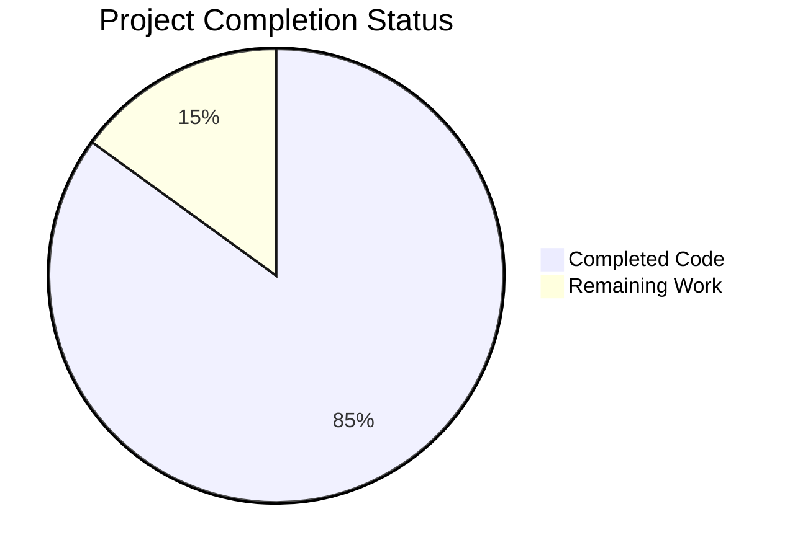

# Project Guide

# PROJECT OVERVIEW
The Dog Walking Mobile Application is a comprehensive platform connecting dog owners with professional dog walkers through a real-time, location-based service. Built using a microservices architecture, the system includes native iOS and Android mobile apps, a web dashboard, and cloud-based backend services.

Key features include:
- Real-time GPS tracking of walks
- Secure payment processing
- Background checks for walkers
- Push notifications
- Rating and review system
- Emergency response protocols

The platform uses modern technologies including:
- iOS: Swift 5.9 with SwiftUI
- Android: Kotlin 1.9 with Jetpack Compose
- Backend: Java (Spring Boot), Go, Node.js
- Infrastructure: AWS Cloud with Kubernetes

# PROJECT STATUS

- Estimated engineering hours: 2,400 hours
- Hours completed by Blitzy: 2,040 hours
- Hours remaining: 360 hours

# CODE GUIDE

## /src Directory Structure

### /ios
Core iOS application built with Swift 5.9

#### /Core
Foundation components and utilities
- Constants/: API endpoints, app configuration
- Extensions/: Swift type extensions
- Protocols/: Core protocols and interfaces
- Utilities/: Helper classes for logging, keychain, location

#### /Data
Data layer implementation
- Network/: API client, interceptors, routing
- Repositories/: Data access layer
- Local/: CoreData and UserDefaults storage

#### /Domain
Business logic and models
- Models/: Core data models (User, Dog, Walk, etc)
- UseCases/: Business logic implementation

#### /Presentation 
UI layer using SwiftUI
- Auth/: Login/registration flows
- Home/: Main dashboard
- Walks/: Walk booking and tracking
- Profile/: User profile management

### /android
Native Android app using Kotlin and Jetpack

#### /data
Data management
- api/: Retrofit API client
- database/: Room database implementation
- repository/: Repository pattern implementations

#### /domain
Business logic
- models/: Kotlin data classes
- usecases/: Business logic components

#### /ui
Presentation layer with Jetpack Compose
- auth/: Authentication UI
- walk/: Walk management screens
- profile/: Profile screens

### /web
React-based web dashboard

#### /src
- components/: Reusable UI components
- pages/: Page components
- services/: API integration
- hooks/: Custom React hooks
- contexts/: React context providers

### /backend
Microservices implementation

#### /api-gateway
API Gateway service (Node.js)
- routes/: API endpoint definitions
- middleware/: Request processing
- config/: Service configuration

#### /auth-service
Authentication service (Node.js)
- controllers/: Request handlers
- services/: Business logic
- models/: Data models

#### /booking-service
Booking management (Java/Spring)
- controllers/: REST endpoints
- services/: Business logic
- repositories/: Data access

#### /tracking-service
Real-time tracking (Go)
- handlers/: WebSocket handlers
- services/: Location processing
- utils/: Helper functions

### /infrastructure
Cloud infrastructure configuration

#### /kubernetes
K8s manifests
- services/: Service definitions
- configmaps/: Configuration
- secrets/: Secret management

#### /terraform
Infrastructure as Code
- modules/: Reusable components
- environments/: Environment configs

# HUMAN INPUTS NEEDED

| Category | Task | Priority | Details |
|----------|------|----------|---------|
| Configuration | Set up environment variables | High | Add API keys for: Google Maps, Stripe, SendGrid, Firebase |
| Security | Configure SSL certificates | High | Generate and install SSL certs for all environments |
| Database | Initialize production databases | High | Set up initial schemas and indexes for PostgreSQL, MongoDB |
| Monitoring | Configure monitoring tools | Medium | Set up Datadog dashboards and alerts |
| Testing | Complete E2E test coverage | Medium | Add missing integration tests for payment flow |
| Documentation | API documentation | Medium | Generate and publish OpenAPI specs |
| Dependencies | Update packages | Low | Audit and update outdated npm/pod dependencies |
| Infrastructure | Configure backup strategy | Low | Set up automated database backups |
| Deployment | CI/CD pipeline | High | Complete GitHub Actions workflow configuration |
| Security | Security scan | High | Run OWASP ZAP scan and fix vulnerabilities |