# Technical Specifications

# 1. INTRODUCTION

## 1.1 Executive Summary

The Dog Walking Mobile Application is a comprehensive platform designed to connect dog owners with professional dog walkers through a real-time, location-based service. The system addresses the growing need for flexible, on-demand pet care services in urban environments by providing a secure, efficient marketplace for dog walking services. Primary stakeholders include busy dog owners seeking reliable care for their pets and verified dog walkers looking to provide professional services. The platform aims to revolutionize the pet care industry by introducing transparent, technology-driven solutions for scheduling, tracking, and managing dog walking services.

The application will deliver significant value through automated matching, real-time tracking, and secure payment processing, projecting to capture 15% of the urban dog walking market within the first year of operation.

## 1.2 System Overview

### Project Context

| Aspect | Details |
|--------|----------|
| Market Position | Premium, tech-enabled dog walking service platform |
| Target Market | Urban areas with high dog ownership density |
| Competitive Advantage | Real-time tracking, verified walkers, instant booking |
| Enterprise Integration | Standalone platform with third-party service integration |

### High-Level Description

| Component | Implementation |
|-----------|----------------|
| Mobile Applications | Native iOS and Android apps |
| Backend Services | Cloud-based microservices architecture |
| Real-time Features | WebSocket-based tracking and messaging |
| Data Management | Distributed database system with geo-partitioning |
| Security Layer | Multi-factor authentication and encryption |

### Success Criteria

| Metric | Target |
|--------|--------|
| User Adoption | 10,000 active users within 6 months |
| Walker Retention | 80% walker retention rate after 3 months |
| Booking Success | 95% booking completion rate |
| System Uptime | 99.9% availability |
| User Satisfaction | 4.5+ average rating |

## 1.3 Scope

### In-Scope Elements

#### Core Features

| Feature Category | Components |
|-----------------|------------|
| User Management | - Owner/walker profiles<br>- Pet profiles<br>- Verification system |
| Booking System | - Real-time availability<br>- Instant matching<br>- Schedule management |
| Service Execution | - GPS tracking<br>- Photo sharing<br>- Status updates |
| Financial Operations | - Secure payments<br>- Automated billing<br>- Transaction history |

#### Implementation Boundaries

| Boundary Type | Coverage |
|--------------|----------|
| Geographic | Major metropolitan areas in North America |
| User Types | Dog owners and individual dog walkers |
| Device Support | iOS 13+ and Android 8.0+ |
| Service Types | Individual dog walking sessions |

### Out-of-Scope Elements

- Pet boarding and overnight services
- Group walking coordination
- Pet training services
- Veterinary service integration
- Pet supply marketplace
- International markets (Phase 1)
- Corporate walking services
- Pet transportation services

# 2. SYSTEM ARCHITECTURE

## 2.1 High-Level Architecture

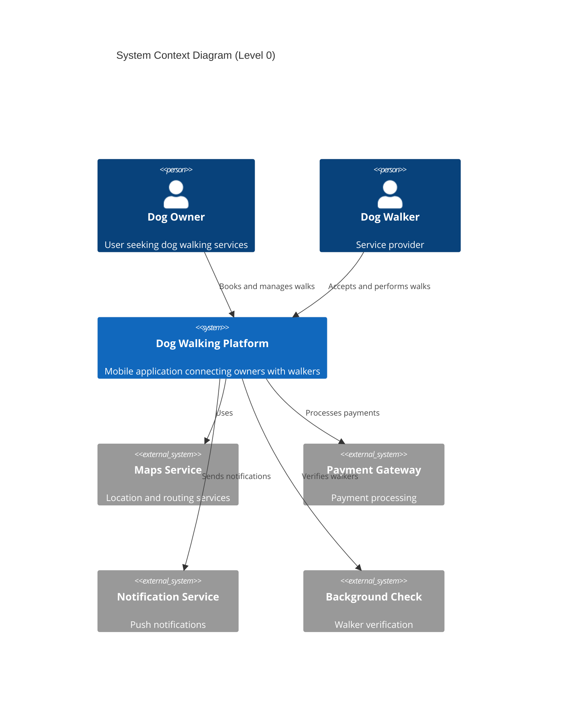

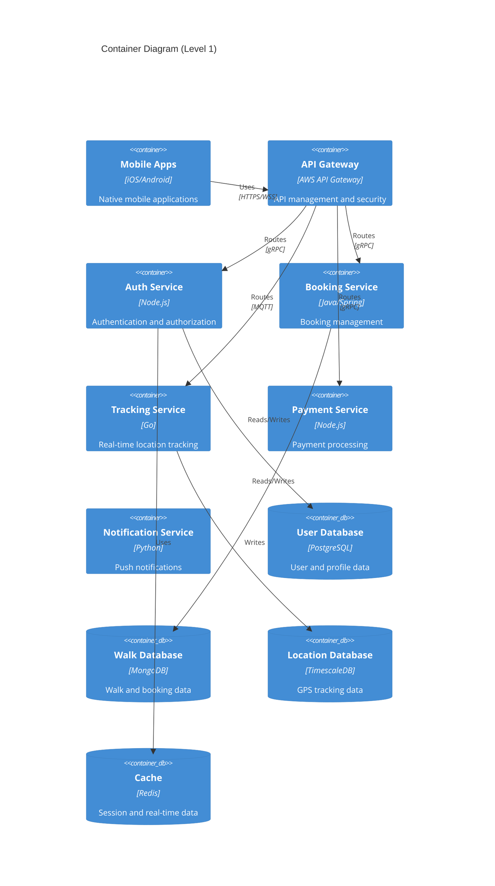

## 2.2 Component Details

### 2.2.1 Core Components

| Component | Details |
|-----------|---------|
| Mobile Apps | - Native iOS (Swift) and Android (Kotlin)<br>- Offline-first architecture<br>- Local SQLite storage<br>- Background location services |
| API Gateway | - AWS API Gateway<br>- Request validation and throttling<br>- JWT authentication<br>- API versioning |
| Auth Service | - Node.js/Express<br>- JWT token management<br>- OAuth2 integration<br>- Role-based access control |
| Booking Service | - Java/Spring Boot<br>- Transactional booking management<br>- Availability scheduling<br>- Pricing engine |
| Tracking Service | - Go microservice<br>- MQTT broker integration<br>- Geofencing capabilities<br>- Route optimization |

### 2.2.2 Data Storage Components

| Component | Technology | Purpose |
|-----------|------------|---------|
| User Database | PostgreSQL | - User profiles<br>- Authentication data<br>- Walker verifications |
| Walk Database | MongoDB | - Booking records<br>- Walk history<br>- Reviews and ratings |
| Location Database | TimescaleDB | - GPS tracking data<br>- Route history<br>- Time-series analytics |
| Cache Layer | Redis | - Session management<br>- Real-time location cache<br>- API response caching |

## 2.3 Technical Decisions

### 2.3.1 Architecture Patterns

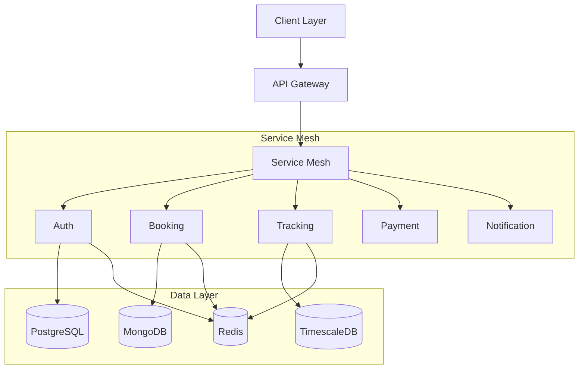

### 2.3.2 Communication Patterns

| Pattern | Implementation | Use Case |
|---------|---------------|-----------|
| Synchronous | REST/gRPC | User authentication, Bookings |
| Asynchronous | MQTT/WebSocket | Location tracking, Notifications |
| Event-Driven | Apache Kafka | System events, Analytics |
| Pub/Sub | Redis Pub/Sub | Real-time updates |

## 2.4 Cross-Cutting Concerns

### 2.4.1 System Monitoring

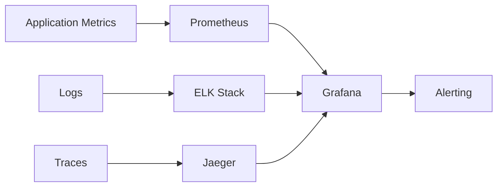

### 2.4.2 Security Architecture

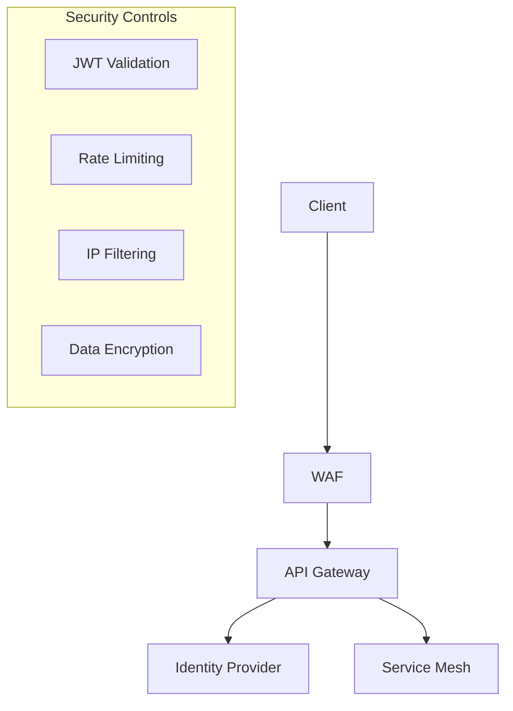

## 2.5 Deployment Architecture

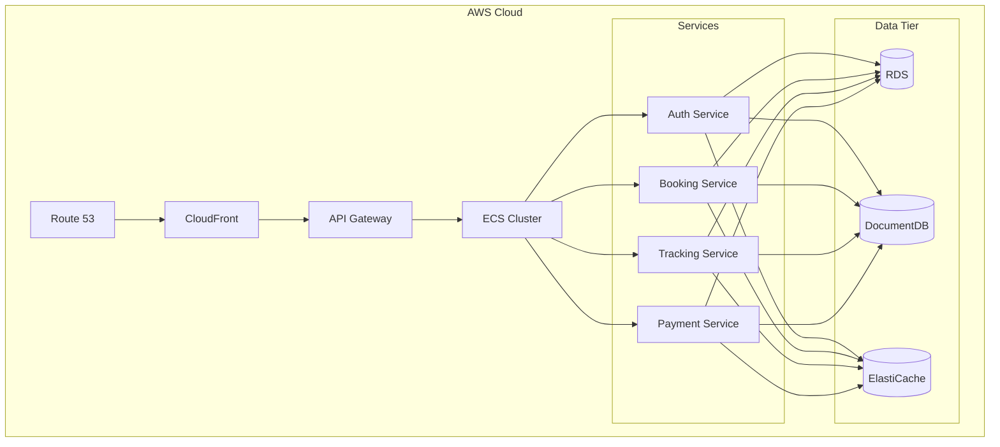

### 2.5.1 Infrastructure Requirements

| Component | Specifications |
|-----------|---------------|
| API Servers | - t3.medium instances<br>- Auto-scaling group (2-10 instances)<br>- Multi-AZ deployment |
| Databases | - Multi-AZ RDS instances<br>- 3-node MongoDB replica set<br>- Redis cluster with failover |
| Storage | - S3 for media storage<br>- EBS volumes for databases<br>- ElastiCache for caching |
| Network | - Private subnets for services<br>- Public subnets for load balancers<br>- VPC peering for cross-region |

# 3. SYSTEM COMPONENTS ARCHITECTURE

## 3.1 User Interface Design

### 3.1.1 Design System Specifications

| Component | Specification |
|-----------|--------------|
| Typography | - Primary: SF Pro (iOS), Roboto (Android)<br>- Scale: 12/14/16/20/24/32px<br>- Line height: 1.5 |
| Color Palette | - Primary: #2196F3<br>- Secondary: #4CAF50<br>- Error: #F44336<br>- Background: #FFFFFF/F5F5F5<br>- Text: #212121/757575 |
| Spacing | - Base unit: 8px<br>- Grid: 4x4 matrix<br>- Margins: 16/24px<br>- Padding: 8/16px |
| Elevation | - Cards: 2dp<br>- Modals: 8dp<br>- Navigation: 4dp<br>- FAB: 6dp |

### 3.1.2 Component Library

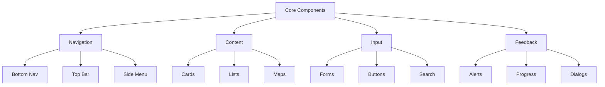

### 3.1.3 Critical User Flows

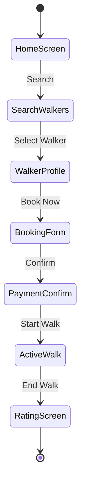

### 3.1.4 Responsive Design Requirements

| Breakpoint | Specifications |
|------------|----------------|
| Mobile (≤375px) | - Single column layout<br>- Bottom navigation<br>- Collapsed menus |
| Mobile (≤428px) | - Single column layout<br>- Extended content width<br>- Floating action buttons |
| Tablet (≤768px) | - Two column layout<br>- Side navigation option<br>- Split view support |
| Desktop (≥1024px) | - Multi-column layout<br>- Persistent side navigation<br>- Advanced map features |

## 3.2 Database Design

### 3.2.1 Schema Design

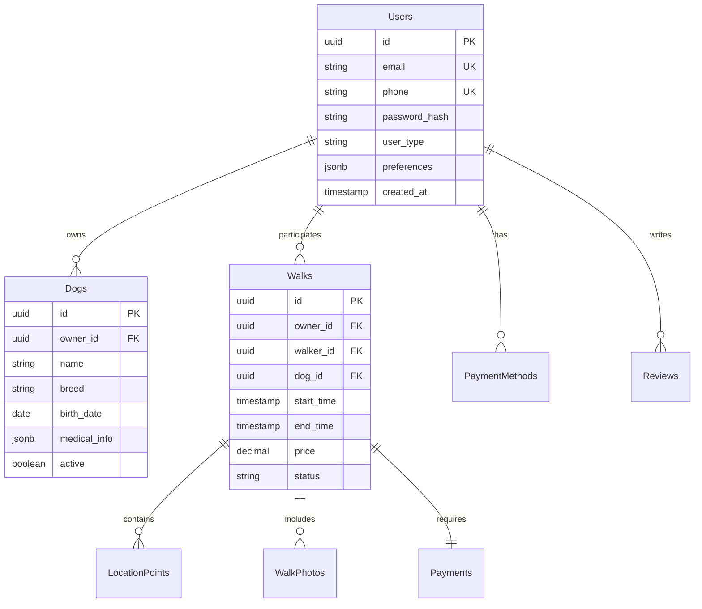

### 3.2.2 Data Management Strategy

| Aspect | Implementation |
|--------|----------------|
| Partitioning | - Time-based partitioning for walks<br>- Geographic sharding for location data<br>- User data distributed by ID |
| Indexing | - B-tree indexes for user lookups<br>- GiST indexes for location queries<br>- Partial indexes for active records |
| Caching | - Redis for session data (TTL: 24h)<br>- Location cache (TTL: 5m)<br>- User profile cache (TTL: 1h) |
| Archival | - Walk data archived after 6 months<br>- Photos moved to cold storage after 3 months<br>- Inactive users archived after 1 year |

## 3.3 API Design

### 3.3.1 API Architecture

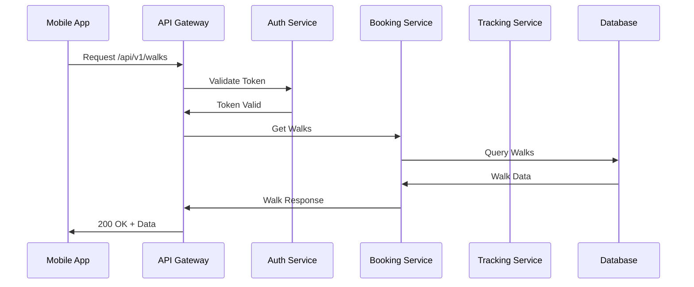

### 3.3.2 API Specifications

| Endpoint Category | Base Path | Version Strategy |
|------------------|-----------|------------------|
| Authentication | /auth/v1/* | URI versioning |
| User Management | /users/v1/* | URI versioning |
| Walks | /walks/v1/* | URI versioning |
| Payments | /payments/v1/* | URI versioning |
| Tracking | /track/v1/* | URI versioning |

### 3.3.3 Security Controls

| Control Type | Implementation |
|--------------|----------------|
| Authentication | - JWT with RS256 signing<br>- 15-minute token expiry<br>- Refresh token rotation |
| Authorization | - RBAC with custom claims<br>- Scope-based access control<br>- Resource-level permissions |
| Rate Limiting | - 100 req/min per user<br>- 1000 req/min per walker<br>- IP-based throttling |
| Data Protection | - Field-level encryption<br>- TLS 1.3 required<br>- API key rotation |

### 3.3.4 Integration Patterns

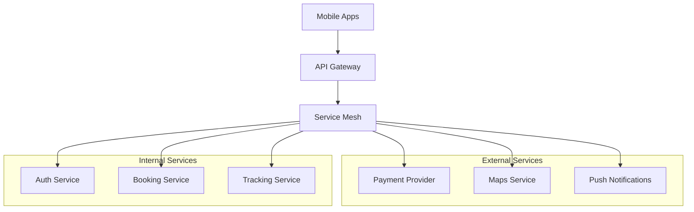

# 4. TECHNOLOGY STACK

## 4.1 PROGRAMMING LANGUAGES

| Platform/Component | Language & Version | Justification |
|-------------------|-------------------|----------------|
| iOS | Swift 5.9 | - Native performance for GPS tracking<br>- Strong type safety<br>- Modern concurrency with async/await<br>- Excellent MapKit integration |
| Android | Kotlin 1.9 | - Official Android development language<br>- Coroutines for async operations<br>- Null safety features<br>- Seamless Java interop |
| Backend Services | Java 17 (Spring Boot) | - Enterprise-grade reliability<br>- Strong microservices support<br>- Extensive ecosystem<br>- High-performance GC |
| Real-time Services | Go 1.21 | - Efficient concurrent processing<br>- Low latency for GPS tracking<br>- Small memory footprint<br>- Native WebSocket support |
| Data Processing | Python 3.11 | - Rich data processing libraries<br>- ML/AI capabilities for future features<br>- Easy integration with analytics tools |

## 4.2 FRAMEWORKS & LIBRARIES

### 4.2.1 Core Frameworks

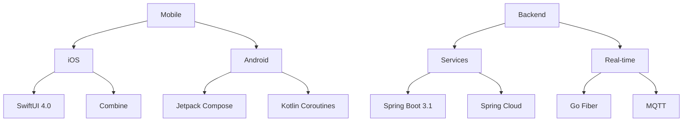

### 4.2.2 Supporting Libraries

| Category | Libraries | Purpose |
|----------|-----------|----------|
| Mobile Maps | - Google Maps SDK 21.0<br>- MapKit 14.0 | Location tracking and visualization |
| Networking | - Alamofire 5.8<br>- Retrofit 2.9<br>- OkHttp 4.11 | HTTP client and networking |
| Real-time | - SocketIO 4.7<br>- WebSocket 1.5 | Real-time communication |
| Security | - CryptoKit<br>- BouncyCastle 1.7<br>- JWT 4.0 | Encryption and authentication |

## 4.3 DATABASES & STORAGE

### 4.3.1 Database Architecture

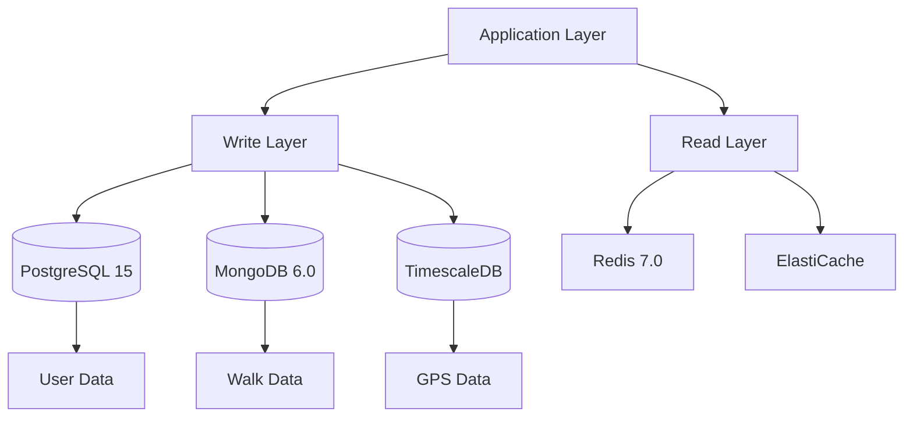

### 4.3.2 Storage Solutions

| Type | Technology | Usage |
|------|------------|--------|
| Primary DB | PostgreSQL 15 | User profiles, transactions |
| Document Store | MongoDB 6.0 | Walk records, reviews |
| Time Series | TimescaleDB | GPS tracking data |
| Cache | Redis 7.0 | Session data, real-time state |
| Object Storage | S3 | Media files, documents |
| CDN | CloudFront | Static assets, media delivery |

## 4.4 THIRD-PARTY SERVICES

### 4.4.1 Service Integration Architecture

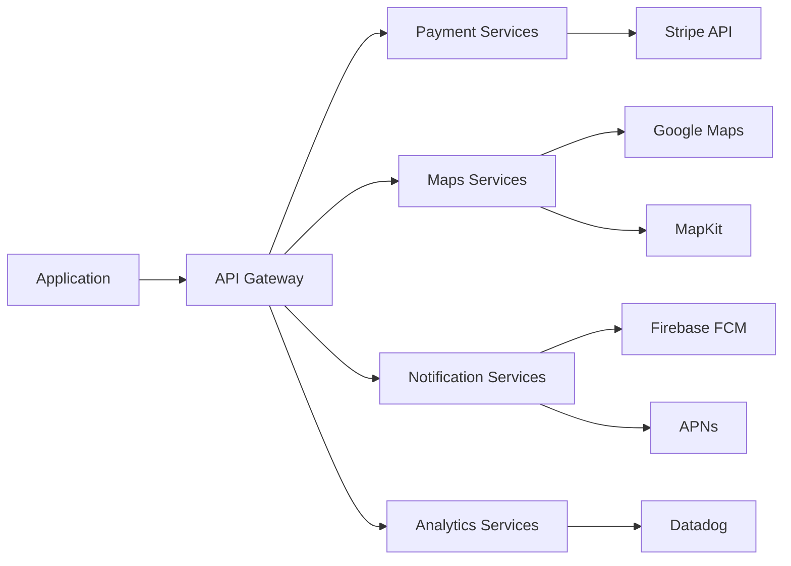

### 4.4.2 Service Matrix

| Category | Service | Purpose | SLA |
|----------|---------|---------|-----|
| Payments | Stripe 2023-10 | Payment processing | 99.99% |
| Maps | Google Maps Platform | Geocoding, routing | 99.9% |
| Push Notifications | Firebase FCM/APNs | User notifications | 99.95% |
| Analytics | Datadog | Monitoring, metrics | 99.9% |
| Authentication | Auth0 | Identity management | 99.99% |
| Email | SendGrid | Transactional emails | 99.95% |

## 4.5 DEVELOPMENT & DEPLOYMENT

### 4.5.1 CI/CD Pipeline

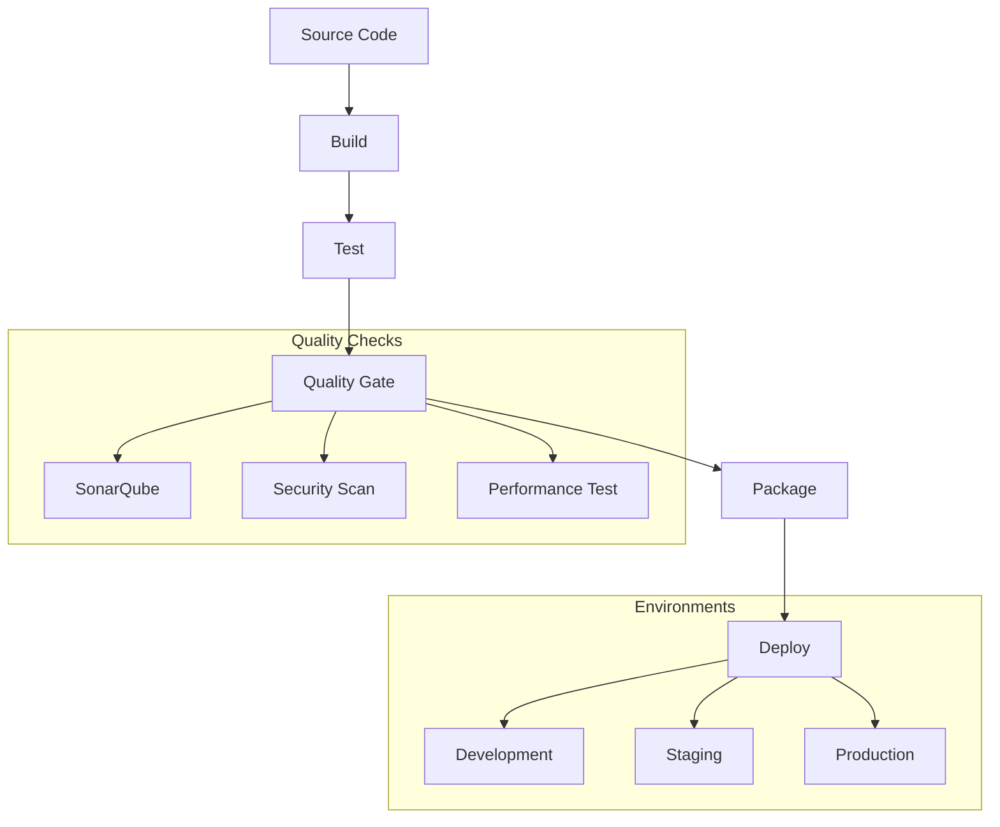

### 4.5.2 Development Tools

| Category | Tools | Purpose |
|----------|-------|---------|
| IDE | - Xcode 15<br>- Android Studio Electric Eel<br>- IntelliJ IDEA 2023.2 | Development environments |
| Version Control | - Git 2.42<br>- GitHub Enterprise | Source code management |
| Build Tools | - Gradle 8.4<br>- Maven 3.9<br>- Fastlane 2.214 | Build automation |
| Containerization | - Docker 24.0<br>- Kubernetes 1.28 | Container orchestration |
| IaC | - Terraform 1.6<br>- AWS CDK 2.0 | Infrastructure management |

# 5. SYSTEM DESIGN

## 5.1 User Interface Design

### 5.1.1 Mobile Navigation Structure

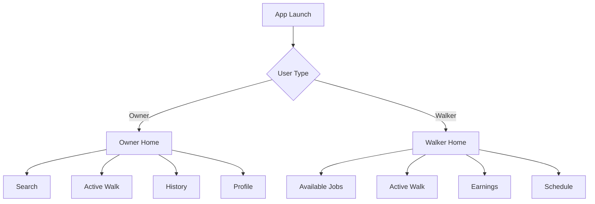

### 5.1.2 Screen Layouts

| Screen | Components | Layout Details |
|--------|------------|----------------|
| Owner Home | - Map View (60% height)<br>- Quick Book Card<br>- Active Walk Status<br>- Recent Walks | - Sticky bottom sheet for actions<br>- FAB for new booking<br>- Pull-to-refresh map |
| Walker Home | - Job List (70% height)<br>- Earnings Summary<br>- Availability Toggle<br>- Status Indicator | - Card-based job listings<br>- Quick accept/decline actions<br>- Status bar for earnings |
| Active Walk | - Full Screen Map<br>- Walk Controls<br>- Timer/Distance<br>- Emergency Button | - Collapsible bottom panel<br>- Persistent emergency button<br>- Photo upload FAB |

### 5.1.3 Component Specifications

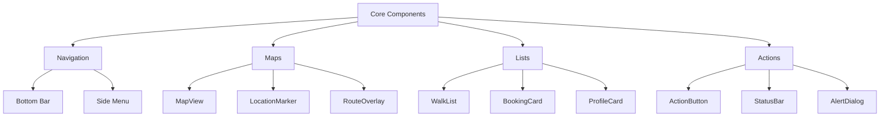

## 5.2 Database Design

### 5.2.1 Schema Design


### 5.2.2 Data Storage Strategy

| Data Type | Storage Solution | Partitioning Strategy |
|-----------|-----------------|----------------------|
| User Data | PostgreSQL | Hash partitioning by user_id |
| Walk Records | MongoDB | Time-based sharding |
| Location Data | TimescaleDB | Hypertables by time and location |
| Media Files | S3 | Path-based partitioning |
| Cache Data | Redis | Key-based sharding |

## 5.3 API Design

### 5.3.1 REST Endpoints

| Endpoint | Method | Purpose | Request/Response |
|----------|--------|---------|------------------|
| /api/v1/walks | POST | Create walk booking | Request: Walk details<br>Response: Booking confirmation |
| /api/v1/walks/{id} | GET | Retrieve walk details | Response: Walk data with tracking |
| /api/v1/users/{id}/dogs | GET | List user's dogs | Response: Array of dog profiles |
| /api/v1/walkers/nearby | GET | Find available walkers | Request: Location, radius<br>Response: Walker list |

### 5.3.2 WebSocket Events

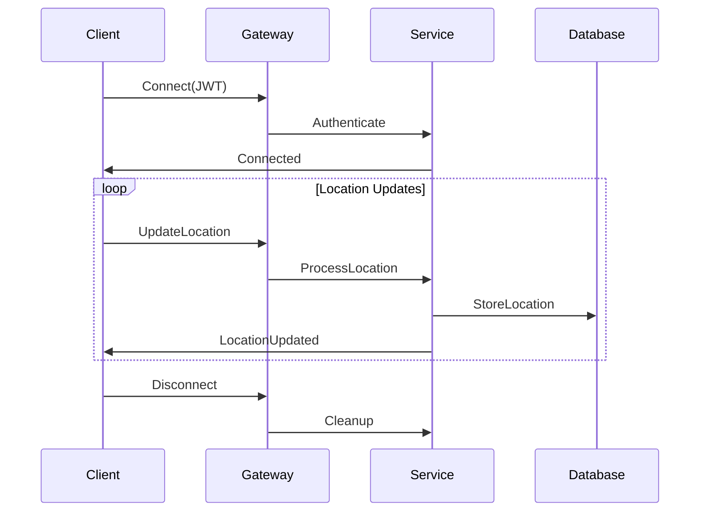

### 5.3.3 API Security

| Security Layer | Implementation |
|----------------|----------------|
| Authentication | JWT with RS256 |
| Authorization | RBAC with scopes |
| Rate Limiting | Token bucket algorithm |
| Input Validation | JSON Schema validation |
| Error Handling | Standard error responses |

## 5.4 Integration Architecture

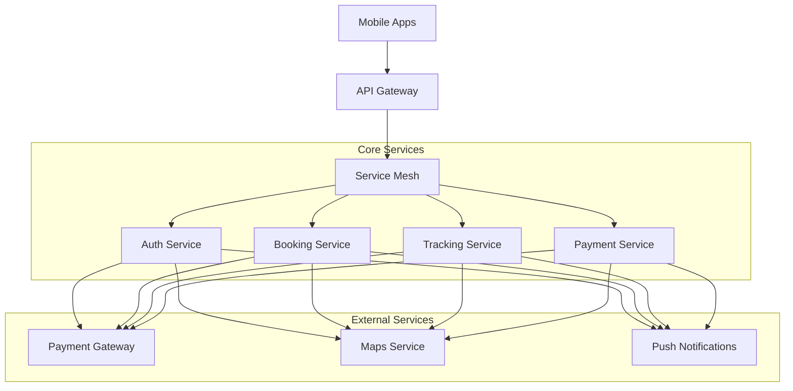

## 5.5 Deployment Architecture

```mermaid
graph TD
    subgraph "AWS Cloud"
        A[Route 53] --> B[CloudFront]
        B --> C[API Gateway]
        C --> D[ECS Cluster]
        
        subgraph "Data Layer"
            E[(RDS)]
            F[(MongoDB)]
            G[(Redis)]
        end
        
        D --> H[Auth Service]
        D --> I[Booking Service]
        D --> J[Tracking Service]
        
        H & I & J --> E & F & G
    end
```

# 6. USER INTERFACE DESIGN

## 6.1 Design System Key

```
ICONS                    COMPONENTS              CONTAINERS
[@] User/Profile        [...] Text Input        +------------------+
[#] Menu/Dashboard      [ ] Checkbox            | Content Box      |
[$] Payment             ( ) Radio Button        +------------------+
[?] Help/Info          [v] Dropdown Menu
[!] Alert/Warning      [Button] Action Button   NAVIGATION
[+] Add/Create         [====] Progress Bar      [<] Previous
[x] Close/Delete       {Tab} Active Tab         [>] Next
[^] Upload             |Tab| Inactive Tab
[=] Settings           
[*] Favorite
```

## 6.2 Core Screen Layouts

### 6.2.1 Owner Home Screen

```
+--------------------------------------------------+
| [@] Profile    [#] Dashboard    [$] Payments  [=] |
+--------------------------------------------------+
|                                                  |
|     +--------------------------------------+     |
|     |           CURRENT LOCATION           |     |
|     |                                      |     |
|     |            [MAP VIEW WITH           |     |
|     |          WALKER LOCATIONS]          |     |
|     |                                      |     |
|     +--------------------------------------+     |
|                                                  |
| [Search Location...]                    [Button] |
|                                                  |
| Available Walkers Nearby:                        |
| +------------------------------------------+    |
| | [@] John D.    4.8★    0.5 miles   [$35] |    |
| | [Book Now]                               |    |
| +------------------------------------------+    |
|                                                  |
| Active Walk:                                     |
| +------------------------------------------+    |
| | [====] In Progress - 15 mins remaining   |    |
| | [@] Sarah W. with Max                    |    |
| | [Track Walk]        [Contact Walker]     |    |
| +------------------------------------------+    |
+--------------------------------------------------+
```

### 6.2.2 Walker Dashboard

```
+--------------------------------------------------+
| [@] Profile    [$] Earnings    [#] Schedule   [=] |
+--------------------------------------------------+
|                                                  |
| Status: [v] Available                            |
|                                                  |
| Current Requests:                                |
| +------------------------------------------+    |
| | [!] New Walk Request                     |    |
| | Max (Golden Retriever) - 2:30 PM         |    |
| | 30 mins - 0.8 miles - $25                |    |
| | [Accept] [Decline]                       |    |
| +------------------------------------------+    |
|                                                  |
| Today's Schedule:                                |
| +------------------------------------------+    |
| | 1:00 PM - Completed                      |    |
| | 2:30 PM - Pending                        |    |
| | 4:00 PM - Confirmed                      |    |
| +------------------------------------------+    |
|                                                  |
| Earnings Today: [$75]                           |
| Rating: 4.9★                                    |
+--------------------------------------------------+
```

### 6.2.3 Active Walk Screen

```
+--------------------------------------------------+
| [<] Back                         [!] Emergency    |
+--------------------------------------------------+
|                                                  |
|     +--------------------------------------+     |
|     |                                      |     |
|     |         REAL-TIME MAP VIEW           |     |
|     |         WITH WALK ROUTE              |     |
|     |         AND CURRENT LOCATION         |     |
|     |                                      |     |
|     +--------------------------------------+     |
|                                                  |
| Walk Progress:                                   |
| [====================] 20/30 mins               |
|                                                  |
| Actions:                                         |
| [^] Photo  [!] Report Issue  [?] Help           |
|                                                  |
| Walk Details:                                    |
| +------------------------------------------+    |
| | Dog: Max                                 |    |
| | Owner: [@] Jane Smith                    |    |
| | Distance: 0.8 miles                      |    |
| | Start Time: 2:30 PM                      |    |
| +------------------------------------------+    |
|                                                  |
| [End Walk]                                      |
+--------------------------------------------------+
```

## 6.3 Component Specifications

### 6.3.1 Navigation Elements

```
Primary Navigation Bar
+--------------------------------------------------+
| {Home} |Tab| Walks |Tab| Messages |Tab| Profile   |
+--------------------------------------------------+

Bottom Navigation
+--------------------------------------------------+
| [#]      [@]      [$]      [=]      [?]          |
| Home    Profile  Payments  Settings  Help         |
+--------------------------------------------------+
```

### 6.3.2 Common Components

```
Alert Component
+------------------------------------------+
| [!] Alert Title                      [x] |
| Alert message with important information |
| [Primary Action]    [Secondary Action]   |
+------------------------------------------+

Search Component
+------------------------------------------+
| [v] Filter    [...Search Location...]    |
| ( ) 1 mile    ( ) 2 miles    (•) 5 miles|
+------------------------------------------+

Profile Card
+------------------------------------------+
| [@] Profile Picture                      |
| Name: John Smith                         |
| Rating: 4.8★ (123 reviews)              |
| [Message]           [Book Walk]          |
+------------------------------------------+
```

## 6.4 Responsive Design Breakpoints

| Breakpoint | Layout Adjustments |
|------------|-------------------|
| Mobile (<375px) | - Single column layout<br>- Collapsed navigation<br>- Stacked cards |
| Mobile (≤428px) | - Single column layout<br>- Bottom navigation<br>- Full-width cards |
| Tablet (≤768px) | - Two column layout<br>- Side navigation option<br>- Grid card layout |
| Desktop (≥1024px) | - Multi-column layout<br>- Expanded navigation<br>- Advanced map features |

## 6.5 Interaction States

```
Button States
[Button] Default
[Button] Hover
[Button] Active
[Button] Disabled

Input States
[...] Default
[...] Focus
[...] Error
[...] Disabled

Loading States
[====] Progress
[....] Loading
[****] Processing
```

# 7. SECURITY CONSIDERATIONS

## 7.1 Authentication and Authorization

### 7.1.1 Authentication Flow

```mermaid
sequenceDiagram
    participant User
    participant App
    participant Gateway
    participant Auth
    participant DB

    User->>App: Enter Credentials
    App->>Gateway: Auth Request
    Gateway->>Auth: Validate Request
    Auth->>DB: Verify Credentials
    DB->>Auth: Credentials Valid
    Auth->>Gateway: Generate JWT
    Gateway->>App: Return Tokens
    App->>User: Auth Complete
```

### 7.1.2 Authentication Methods

| Method | Implementation | Use Case |
|--------|----------------|----------|
| Email/Password | - Argon2id hashing<br>- Minimum 12 characters<br>- Complexity requirements | Primary authentication |
| Social Auth | - OAuth 2.0 with PKCE<br>- Google, Apple, Facebook providers | Alternative sign-in |
| Biometric | - TouchID/FaceID<br>- Android Biometric API | Mobile app access |
| MFA | - Time-based OTP<br>- SMS verification<br>- Email verification | High-risk operations |

### 7.1.3 Authorization Model

```mermaid
graph TD
    A[User Request] --> B{JWT Valid?}
    B -->|Yes| C{Role Check}
    B -->|No| D[Reject Request]
    
    C -->|Owner| E[Owner Permissions]
    C -->|Walker| F[Walker Permissions]
    C -->|Admin| G[Admin Permissions]
    
    E --> H[Resource Access]
    F --> H
    G --> H
```

## 7.2 Data Security

### 7.2.1 Data Classification

| Data Type | Classification | Protection Measures |
|-----------|---------------|-------------------|
| User Credentials | Critical | - AES-256 encryption<br>- Secure key management<br>- Encrypted at rest |
| Payment Information | Critical | - PCI DSS compliance<br>- Tokenization<br>- No local storage |
| Personal Information | Sensitive | - Field-level encryption<br>- Access logging<br>- Data masking |
| Location Data | Sensitive | - Encrypted transmission<br>- Time-limited storage<br>- Anonymization |
| Walk Records | Internal | - Encrypted backups<br>- Access controls<br>- Audit trails |

### 7.2.2 Encryption Standards

| Layer | Standard | Implementation |
|-------|----------|----------------|
| Transport | TLS 1.3 | - Perfect forward secrecy<br>- Strong cipher suites<br>- Certificate pinning |
| Storage | AES-256-GCM | - Envelope encryption<br>- Key rotation<br>- AWS KMS integration |
| Application | RSA-2048 | - End-to-end messaging<br>- Secure key exchange<br>- Digital signatures |

## 7.3 Security Protocols

### 7.3.1 Access Control

```mermaid
flowchart TD
    A[Request] --> B{Authentication}
    B -->|Valid| C{Authorization}
    B -->|Invalid| D[Deny Access]
    
    C -->|Permitted| E[Resource Access]
    C -->|Denied| D
    
    E --> F{Rate Limit}
    F -->|Within Limit| G[Grant Access]
    F -->|Exceeded| D
```

### 7.3.2 Security Monitoring

| Component | Monitoring Approach |
|-----------|-------------------|
| API Gateway | - Request logging<br>- Anomaly detection<br>- DDoS protection |
| Application | - Error tracking<br>- Security events<br>- User activity logs |
| Infrastructure | - Resource monitoring<br>- Vulnerability scanning<br>- Intrusion detection |
| Database | - Access logging<br>- Query analysis<br>- Backup verification |

### 7.3.3 Security Response

| Incident Type | Response Protocol |
|--------------|-------------------|
| Data Breach | 1. Incident containment<br>2. Impact assessment<br>3. User notification<br>4. System hardening |
| Authentication Attack | 1. Account lockout<br>2. IP blocking<br>3. Credential reset<br>4. Attack analysis |
| API Abuse | 1. Rate limit adjustment<br>2. Token revocation<br>3. Access pattern analysis<br>4. Security patch |

### 7.3.4 Compliance Controls

| Requirement | Implementation |
|-------------|----------------|
| GDPR | - Data minimization<br>- Right to erasure<br>- Privacy by design<br>- Data protection impact assessments |
| PCI DSS | - Cardholder data encryption<br>- Network segmentation<br>- Regular security testing<br>- Access control measures |
| SOC 2 | - Security monitoring<br>- Change management<br>- Incident response<br>- Vendor management |

### 7.3.5 Security Testing

| Test Type | Frequency | Coverage |
|-----------|-----------|----------|
| Penetration Testing | Quarterly | - API endpoints<br>- Mobile applications<br>- Infrastructure |
| Vulnerability Scanning | Weekly | - Known CVEs<br>- Configuration issues<br>- Security patches |
| Security Audits | Bi-annual | - Access controls<br>- Encryption implementation<br>- Security policies |
| Code Analysis | Continuous | - SAST/DAST integration<br>- Dependency scanning<br>- Security best practices |

# 8. INFRASTRUCTURE

## 8.1 DEPLOYMENT ENVIRONMENT

```mermaid
graph TD
    subgraph "Production Environment"
        A[AWS Cloud] --> B[Multi-Region Deployment]
        B --> C[Primary Region - US East]
        B --> D[Secondary Region - US West]
        
        C & D --> E[Availability Zones]
        E --> F[VPC Architecture]
        
        F --> G[Public Subnets]
        F --> H[Private Subnets]
        F --> I[Database Subnets]
    end
```

| Environment Type | Configuration |
|-----------------|---------------|
| Development | - Single region (US East)<br>- Reduced infrastructure<br>- Shared services |
| Staging | - Single region with multi-AZ<br>- Production-like setup<br>- Isolated services |
| Production | - Multi-region active-active<br>- Full HA configuration<br>- Dedicated services |
| DR | - Cross-region failover<br>- Automated recovery<br>- Data replication |

## 8.2 CLOUD SERVICES

### 8.2.1 AWS Service Stack

| Service Category | AWS Service | Purpose |
|-----------------|-------------|----------|
| Compute | - ECS Fargate<br>- Lambda | - Container orchestration<br>- Serverless functions |
| Database | - Aurora PostgreSQL<br>- DocumentDB<br>- ElastiCache | - Primary database<br>- Document storage<br>- Caching layer |
| Storage | - S3<br>- EFS | - Media storage<br>- Shared file system |
| Networking | - Route 53<br>- CloudFront<br>- API Gateway | - DNS management<br>- CDN<br>- API management |
| Security | - WAF<br>- Shield<br>- KMS | - Web application firewall<br>- DDoS protection<br>- Key management |
| Monitoring | - CloudWatch<br>- X-Ray | - System monitoring<br>- Distributed tracing |

### 8.2.2 High Availability Architecture

```mermaid
graph TD
    subgraph "AWS Global"
        A[Route 53] --> B[CloudFront]
        B --> C[WAF/Shield]
    end
    
    subgraph "Region 1"
        C --> D1[ALB]
        D1 --> E1[ECS Cluster]
        E1 --> F1[Services]
        F1 --> G1[Aurora Primary]
    end
    
    subgraph "Region 2"
        C --> D2[ALB]
        D2 --> E2[ECS Cluster]
        E2 --> F2[Services]
        F2 --> G2[Aurora Replica]
    end
    
    G1 <--> G2
```

## 8.3 CONTAINERIZATION

### 8.3.1 Docker Configuration

| Component | Container Specification |
|-----------|------------------------|
| API Services | - Base: Node 18-alpine<br>- Multi-stage builds<br>- Non-root user<br>- Health checks |
| Background Workers | - Base: Python 3.11-slim<br>- Optimized dependencies<br>- Volume mounts for data |
| Monitoring Tools | - Base: Grafana/Prometheus<br>- Persistent storage<br>- Custom dashboards |

### 8.3.2 Container Security

```mermaid
graph TD
    A[Container Security] --> B[Image Scanning]
    A --> C[Runtime Security]
    A --> D[Access Control]
    
    B --> B1[Trivy Scanner]
    B --> B2[ECR Scanning]
    
    C --> C1[AppArmor]
    C --> C2[SELinux]
    
    D --> D1[IAM Roles]
    D --> D2[Service Mesh]
```

## 8.4 ORCHESTRATION

### 8.4.1 ECS Configuration

| Component | Configuration |
|-----------|--------------|
| Task Definitions | - CPU: 1 vCPU<br>- Memory: 2GB<br>- Auto-scaling rules<br>- Health checks |
| Service Discovery | - Cloud Map integration<br>- DNS resolution<br>- Service mesh enabled |
| Load Balancing | - Application Load Balancer<br>- Target group routing<br>- SSL termination |

### 8.4.2 Service Mesh Architecture

```mermaid
graph TD
    A[App Mesh] --> B[Virtual Services]
    B --> C[Virtual Nodes]
    C --> D[Virtual Routers]
    
    subgraph "Traffic Management"
        D --> E[Route Rules]
        D --> F[Retry Policies]
        D --> G[Circuit Breakers]
    end
```

## 8.5 CI/CD PIPELINE

### 8.5.1 Pipeline Architecture

```mermaid
graph LR
    A[Source] --> B[Build]
    B --> C[Test]
    C --> D[Security Scan]
    D --> E[Deploy Dev]
    E --> F[Integration Tests]
    F --> G[Deploy Staging]
    G --> H[E2E Tests]
    H --> I[Deploy Prod]
```

### 8.5.2 Pipeline Components

| Stage | Tools & Configuration |
|-------|---------------------|
| Source Control | - GitHub Enterprise<br>- Branch protection<br>- Signed commits |
| Build | - AWS CodeBuild<br>- Docker multi-stage builds<br>- Artifact caching |
| Testing | - Jest for unit tests<br>- Cypress for E2E<br>- SonarQube for code quality |
| Security | - Snyk for dependencies<br>- OWASP ZAP for DAST<br>- Trivy for containers |
| Deployment | - AWS CodeDeploy<br>- Blue/Green strategy<br>- Automated rollback |
| Monitoring | - CloudWatch metrics<br>- Grafana dashboards<br>- PagerDuty alerts |

### 8.5.3 Environment Promotion

| Environment | Promotion Criteria |
|-------------|-------------------|
| Development | - All unit tests pass<br>- Code quality gates<br>- Security scan clear |
| Staging | - Integration tests pass<br>- Performance benchmarks<br>- Manual QA approval |
| Production | - E2E tests pass<br>- Security review<br>- Change advisory approval |

# 8. APPENDICES

## 8.1 ADDITIONAL TECHNICAL INFORMATION

### 8.1.1 Background Check Integration Flow

```mermaid
sequenceDiagram
    participant Walker
    participant App
    participant Auth
    participant Check
    participant Admin
    
    Walker->>App: Submit verification request
    App->>Auth: Validate identity
    Auth->>Check: Initiate background check
    Check-->>Walker: Request documents
    Walker->>Check: Submit documents
    Check->>Check: Process verification
    Check-->>Admin: Review results
    Admin->>Auth: Approve/Reject
    Auth-->>App: Update walker status
    App-->>Walker: Notify result
```

### 8.1.2 Emergency Response Protocol

| Priority Level | Response Time | Actions Required |
|---------------|---------------|------------------|
| Critical (P0) | < 5 minutes | - Emergency services notification<br>- Owner immediate contact<br>- Support team escalation |
| High (P1) | < 15 minutes | - Owner notification<br>- Support team contact<br>- Walk suspension |
| Medium (P2) | < 30 minutes | - Support team notification<br>- Incident documentation<br>- Follow-up required |
| Low (P3) | < 2 hours | - Incident logging<br>- Standard follow-up<br>- Review at end of walk |

### 8.1.3 Data Retention Schedule

| Data Category | Active Storage | Archive Period | Deletion Policy |
|---------------|---------------|----------------|-----------------|
| User Profiles | Duration of account | 2 years post-deletion | Soft delete, then purge |
| Walk Records | 1 year | 6 years | Anonymize after archive |
| GPS Data | 30 days | 6 months | Aggregate then delete |
| Chat Messages | 90 days | 1 year | Encrypt then archive |
| Payment Records | 2 years | 7 years | Required retention |
| Media Files | 90 days | 1 year | Move to cold storage |

## 8.2 GLOSSARY

| Term | Definition |
|------|------------|
| Active Walk | A dog walking session currently in progress with live GPS tracking |
| Cold Storage | Low-cost storage solution for infrequently accessed data |
| Geofencing | Virtual perimeter for real-time geographic boundary tracking |
| Hypertable | Time-series optimized database table for GPS tracking data |
| Service Mesh | Infrastructure layer handling service-to-service communication |
| Soft Delete | Marking records as deleted without physical removal |
| Walker Rating | Aggregate score based on completed walks and owner reviews |
| Walk Zone | Predefined geographic area where walker offers services |

## 8.3 ACRONYMS

| Acronym | Full Form | Context |
|---------|-----------|---------|
| AES | Advanced Encryption Standard | Data encryption |
| CDN | Content Delivery Network | Media file distribution |
| E2E | End-to-End | Testing methodology |
| ECS | Elastic Container Service | AWS container orchestration |
| FAB | Floating Action Button | UI component |
| GZIP | GNU ZIP | Data compression |
| HA | High Availability | System architecture |
| IAM | Identity and Access Management | AWS security |
| MQTT | Message Queuing Telemetry Transport | IoT communication protocol |
| PII | Personally Identifiable Information | Data privacy |
| PKCE | Proof Key for Code Exchange | OAuth security |
| QoS | Quality of Service | Service reliability |
| RBAC | Role-Based Access Control | Authorization system |
| S3 | Simple Storage Service | AWS storage |
| SDK | Software Development Kit | Development tools |
| SLA | Service Level Agreement | Service guarantees |
| TTL | Time To Live | Cache expiration |
| VPC | Virtual Private Cloud | Network isolation |