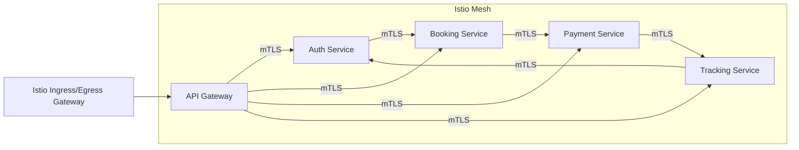

# Kubernetes Infrastructure for the Dog Walking Platform

This documentation provides a comprehensive, production-grade reference for deploying and configuring the Dog Walking Platform’s Kubernetes infrastructure. It addresses multi-region high availability, service mesh security with mTLS, robust system monitoring with Prometheus and Grafana, and a step-by-step deployment process. All references to technical requirements align with the system design specifications and the following sections offer in-depth instructions and guidance.

---

## Table of Contents

1. [Overview](#overview)  
   1.1 [System Requirements](#system-requirements)  
   1.2 [Architecture Overview](#architecture-overview)  
   1.3 [Component Relationships](#component-relationships)

2. [Prerequisites](#prerequisites)  
   2.1 [Tool Installation](#tool-installation)  
   2.2 [Access Configuration](#access-configuration)  
   2.3 [Resource Requirements](#resource-requirements)

3. [Architecture](#architecture)  
   3.1 [Cluster Architecture](#cluster-architecture)  
   3.2 [Network Flow](#network-flow)  
   3.3 [Service Mesh Topology](#service-mesh-topology)

4. [Installation](#installation)  
   4.1 [Cluster Setup](#cluster-setup)  
   4.2 [Service Deployment](#service-deployment)  
   4.3 [Validation Steps](#validation-steps)

5. [Security](#security)  
   5.1 [Network Policies](#network-policies)  
   5.2 [Secret Management](#secret-management)  
   5.3 [Access Controls](#access-controls)

6. [Monitoring](#monitoring)  
   6.1 [Prometheus Configuration](#prometheus-configuration)  
   6.2 [Grafana Dashboards](#grafana-dashboards)  
   6.3 [Alert Rules](#alert-rules)

7. [Exports](#exports)  
   7.1 [deployment_guide](#deployment_guide)  
       7.1.1 [installation_steps](#installation_steps)  
       7.1.2 [configuration_guide](#configuration_guide)  
       7.1.3 [validation_procedures](#validation_procedures)  
   7.2 [operations_manual](#operations_manual)  
       7.2.1 [monitoring_setup](#monitoring_setup)  
       7.2.2 [troubleshooting_guide](#troubleshooting_guide)  
       7.2.3 [disaster_recovery](#disaster_recovery)

8. [References](#references)

---

## Overview

This documentation covers the Kubernetes infrastructure powering the Dog Walking Platform. The goal is to ensure an environment that meets enterprise standards for:
• High availability (clusters spanning multiple regions with auto-scaling and failover).  
• Comprehensive security (mTLS, mesh-level policies, and RBAC).  
• Real-time application monitoring (Prometheus, Grafana).  
• Automated deployment and configuration.

### 1.1 System Requirements

• Kubernetes version: v1.28  
• Istio version: v1.20  
• Prometheus version: v2.45  
• Grafana version: v9.5  
• Ability to create and manage multi-region Kubernetes clusters.  
• Adequate resources and IAM permissions for provisioning underlying compute, network, and storage.

### 1.2 Architecture Overview

The primary objectives of this Kubernetes design include:  
• High Availability Architecture (per System Architecture §2.1): Multi-region clusters, horizontal auto-scaling, and resilience against node or zone failures.  
• System Monitoring (per Cross-Cutting Concerns §2.4.1): Real-time metrics collection, custom dashboards, and automated alerts.  
• Security Architecture (per Cross-Cutting Concerns §2.4.2): Istio-based service mesh with mutual TLS, network segmentation via policies, secret management, and strong encryption.  
• Deployment Architecture (per §2.5): Integration with container orchestration and support for rolling or blue/green deploys.

### 1.3 Component Relationships

A high-level illustration of the Kubernetes components working together includes:
• Namespaces (management of environment isolation).  
• Deployments (manages Pod replicas for each microservice).  
• Services (stable DNS for each microservice).  
• HorizontalPodAutoscaler (automatic scaling for API Gateway and core services).  
• Istio Operator (service mesh deployment, controlling Gateways and VirtualServices).  
• ConfigMaps and Secrets (application configuration and sensitive credentials).  

For API Gateway specifics, refer to “api-gateway.yaml,” which includes Deployment, Service, and HPA definitions. For service mesh configuration, see “service-mesh.yaml,” providing the IstioOperator, Gateway, and VirtualService expansions.

---

## Prerequisites

### 2.1 Tool Installation

Ensure the following command-line tools and relevant AWS integrations are installed:

• kubectl (compatible with Kubernetes v1.28)  
• eksctl (for quick provisioning of EKS clusters, if using AWS)  
• istioctl (for installing and verifying Istio v1.20)  
• Helm (optional, often used for advanced chart management)  
• AWS CLI (if using Amazon EKS, S3, or other AWS services)  
• Terraform or AWS CDK (optional if using IaC approach)

### 2.2 Access Configuration

1. Configure AWS credentials with sufficient IAM permissions to create EKS clusters, VPCs, security groups, and related AWS resources.  
2. Provide kubectl with admin-level access to the cluster. Typically, your AWS IAM identity or GCP/Azure identity must be mapped into the cluster RBAC.  
3. Confirm network egress settings allow pulling images from Docker registries or ECR.

### 2.3 Resource Requirements

The following baseline ensures each microservice can run adequately within production constraints:

• Minimum cluster size: 3 worker nodes per region.  
• Node type: e.g., m5.large or higher, depending on transaction volume.  
• Node memory: 8 GB or more per node.  
• Sufficient CPU capacity (2–4 vCPU per node recommended for moderate workloads).  
• Additional overhead for Istio sidecar injection (memory requests for Pilot, Gateways, sidecars).

---

## Architecture

### 3.1 Cluster Architecture

Below is a conceptual diagram of our multi-region Kubernetes infrastructure, incorporating the salient points described in the High-Level Architecture (System Architecture §2.1):

```mermaid
flowchart TD
    A((Client)) -->|HTTPS| B[Global DNS]
    B --> C[Region 1<br>(Kubernetes Cluster)]
    B --> D[Region 2<br>(Kubernetes Cluster)]
    C --> E[API Gateway Pods (HPA)]
    D --> F[API Gateway Pods (HPA)]
    E -->|Istio mTLS| G[Service Set (Auth, Booking, Payment...)]
    F -->|Istio mTLS| H[Service Set (Auth, Booking, Payment...)]
    G & H --> I[(Shared Data Storage)]
```

• Each region hosts a fully functional Kubernetes cluster for redundancy.  
• The user hits a Global DNS endpoint that routes to the nearest or healthiest region.  
• Each cluster runs an API Gateway with a Deployment, Service, and HorizontalPodAutoscaler config (see “api-gateway.yaml”).  
• Istio ensures encrypted in-cluster traffic via mTLS.  

### 3.2 Network Flow

1. External requests (HTTPS) land at the Ingress Gateway associated with the cluster.  
2. Istio routes traffic to internal VirtualServices, directing requests to microservices.  
3. NetworkPolicies restrict east-west traffic among namespaces, ensuring finer-grained security.  
4. The pods, sidecars, and control plane communicate with TLS enforced by the service mesh.

### 3.3 Service Mesh Topology

Below is a simplified service mesh with Istio (per “service-mesh.yaml”) managing secure traffic:



• The IstioOperator resource configures global mTLS and enforces strict outbound traffic policies.  
• VirtualServices define traffic routing rules.  
• Gateways control external access, bridging the zero-trust perimeter.

---

## Installation

### 4.1 Cluster Setup

This step outlines how to initialize a Kubernetes cluster (e.g., in AWS EKS). Adjust accordingly if using another cloud:

1. **Cluster Initialization**  
   • Command:  
     ```
     eksctl create cluster -f cluster-config.yaml
     ```  
   • Validation:  
     ```
     kubectl get nodes
     ```  
   • Rollback:  
     ```
     eksctl delete cluster
     ```

2. (Optional) If you manage multi-region manually, repeat the creation steps in each region or enable advanced multi-region features in your platform.

### 4.2 Service Deployment

Once your cluster is online, deploy core services:

1. **Namespace Creation**  
   - Ensure each microservice namespace is created (e.g., “api-gateway,” “auth-service,” etc.).  

2. **Apply Configuration and Secrets**  
   - kubectl apply -f configmaps.yaml  
   - kubectl apply -f secrets.yaml  

3. **Install Istio (Service Mesh Installation)**  
   • Command:  
     ```
     istioctl install -f service-mesh.yaml
     ```  
   • Validation:  
     ```
     istioctl verify-install
     ```  
   • Rollback:  
     ```
     istioctl uninstall --purge
     ```

4. **Deploy Microservices**  
   - For the API Gateway, use “api-gateway.yaml,” which installs the Deployment, Service, and HPA.  
   - For the rest of the microservices, apply their respective YAML manifests (e.g., “auth-service.yaml,” “booking-service.yaml”).  

### 4.3 Validation Steps

• Confirm all pods are in a “Running” or “Ready” state:
  ```
  kubectl get pods --all-namespaces
  ```  
• Verify services respond correctly using port-forward or your configured Ingress.  
• Validate each microservice logs success messages without errors in real-time.  

---

## Security

### 5.1 Network Policies

• The platform enforces zero-trust networking via `NetworkPolicy` definitions in each manifest.  
• Example: The API Gateway limits inbound traffic to specific CIDR blocks and egress traffic to known namespaces only (refer to “api-gateway.yaml” > NetworkPolicy).  
• This isolation ensures each microservice can only communicate with the appropriate set of downstream or upstream services.

### 5.2 Secret Management

• All sensitive credentials (JWT secrets, API keys, etc.) are stored in Kubernetes Secrets (`secrets.yaml`).  
• Where possible, integrate with external vault solutions for rotation (the example annotations in “secrets.yaml” show KMS encryption).  
• Access to secrets is restricted via RBAC so only authorized pods and service accounts can mount them.

### 5.3 Access Controls

• Strict RBAC is enforced with role-based policies for each microservice.  
• Istio mTLS enforces service-to-service encryption, ensuring only valid workloads in the mesh can communicate.  
• Observability data is also protected at transit using TLS 1.3 where possible.

---

## Monitoring

### 6.1 Prometheus Configuration

• Prometheus (v2.45) scrapes metrics from services and Istio sidecars.  
• Custom resource usage metrics and application-specific metrics are exposed on standard paths (`/metrics` or `/actuator/prometheus`).  
• For a typical installation:  
  ```
  kubectl create namespace monitoring
  helm install prom -n monitoring prometheus-community/prometheus
  ```
  Then configure the ServiceMonitor definitions to automatically scrape your microservice pods.

### 6.2 Grafana Dashboards

• Grafana (v9.5) provides a central place to visualize metrics.  
• Import or build dashboards for:  
  - Pod resource usage (CPU, memory).  
  - API Gateway request rates and latencies.  
  - Booking Service and Auth Service custom metrics.  
  - Istio telemetry (mTLS success/failure, request distribution).  
• Reference your Prometheus data source with appropriate queries and panels.

### 6.3 Alert Rules

• Alert rules can be defined in Prometheus to trigger notifications for conditions:  
  - Pod restarts exceed threshold.  
  - CPU usage beyond 80% for 5 minutes.  
  - Memory usage close to container limit.  
  - High 5xx error rate in API requests.  
• Integrate with PagerDuty, Slack, or email for immediate alerts.

---

## Exports

### 7.1 deployment_guide

The deployment_guide provides comprehensive instructions for installing and maintaining the Kubernetes infrastructure.

#### 7.1.1 installation_steps

1. **Initialize Cluster(s)**  
   • Using eksctl or your preferred method (see [Cluster Setup](#cluster-setup)).  

2. **Apply Base Manifests**  
   • Namespaces, ConfigMaps, Secrets, RBAC.  

3. **Install Istio Service Mesh**  
   • Deploy `service-mesh.yaml` using `istioctl install`.  

4. **Deploy Microservices**  
   • `kubectl apply -f api-gateway.yaml`  
   • `kubectl apply -f auth-service.yaml`  
   • `kubectl apply -f booking-service.yaml`  
   • … and any other microservice manifests.  

5. **Configure Ingress**  
   • Expose traffic to external users via `ingress.yaml`, ensuring TLS is valid.  

#### 7.1.2 configuration_guide

• **api-gateway.yaml**  
  - `deployment`, `service`, `hpa`: Adjust replica counts, CPU/memory requests as needed.  
  - Verify environment variables (e.g., RATE_LIMIT_WINDOW, JWT_SECRET).  

• **service-mesh.yaml**  
  - `istio-operator`, `gateway`, `virtual-service`: Fine-tune mTLS, traffic routing, default config for pilot resource usage.  

• **Secrets & ConfigMaps**  
  - Update credentials in `secrets.yaml`.  
  - Keep all non-sensitive configuration in `configmaps.yaml`.  

• **Network Policies**  
  - Confirm allowed ingress/egress ranges reflect your environment.  

#### 7.1.3 validation_procedures

1. Run `kubectl get pods -A` and confirm all deployed pods are `Running` or `Completed`.  
2. Run Istio-specific checks:  
   ```
   istioctl analyze
   ```  
   to detect misconfigurations in VirtualServices, Gateways, or sidecar injection.  
3. Validate external traffic:  
   ```
   curl -k https://api.dogwalking.com/api/v1/auth/health
   ```  
   should return a healthy 200 status code.  
4. Confirm logs show normal service operation, with minimal errors or warnings.

### 7.2 operations_manual

The operations_manual focuses on day-two operational tasks, from observability to disaster recovery.

#### 7.2.1 monitoring_setup

• **Prometheus**:  
  - Deployed in `monitoring` namespace; configures job scrapes for each microservice.  
  - Explore its UI at http://<prometheus-service>:9090.  

• **Grafana**:  
  - Deployed in `monitoring` namespace.  
  - Dashboards for resource usage, application metrics, and Istio telemetry.  

• **Operational Procedures**:  
  - Health Monitoring –  
    - Command: `kubectl get pods -A | grep -v Running`  
    - Frequency: Every 5 minutes  
    - Action: Alert if a non-running pod is detected.  

#### 7.2.2 troubleshooting_guide

1. **Pod Not Starting**  
   - Check logs: `kubectl logs <pod_name>`  
   - Confirm secrets or config references are correct (e.g., environment variables).  

2. **mTLS or Service Mesh Failures**  
   - Ensure sidecar injection is enabled in the target namespaces.  
   - Run `istioctl proxy-status` to verify sidecar connectivity.  

3. **Performance Issues**  
   - Increase resource limits in `Deployment` specs.  
   - Scale horizontally via HPA or ephemeral nodes.  

4. **Ingress Errors**  
   - Validate certificate status (with cert-manager if used).  
   - Check Ingress logs for 4xx or 5xx patterns.

#### 7.2.3 disaster_recovery

• Maintain frequent backups using tools like Velero:  
  - Command: `velero backup create full-backup`  
  - Frequency: Daily  
  - Retention: 30 days  

• Cross-region replication of container images, secrets, and configuration.  
• Keep separate ephemeral backups of persistent volumes or external DB snapshots.

---

## References

• [Kubernetes v1.28 Documentation](https://kubernetes.io/docs/home/)  
• [Istio v1.20 Documentation](https://istio.io/latest/docs/)  
• [Prometheus v2.45 Documentation](https://prometheus.io/docs/introduction/overview/)  
• [Grafana v9.5 Documentation](https://grafana.com/docs/)  
• Internal YAML Manifests (Imported):  
  - [api-gateway.yaml](api-gateway.yaml): Contains Deployment, Service, HPA configuration.  
  - [service-mesh.yaml](service-mesh.yaml): Defines IstioOperator, Gateway, VirtualService.